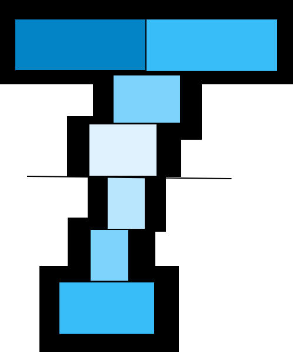
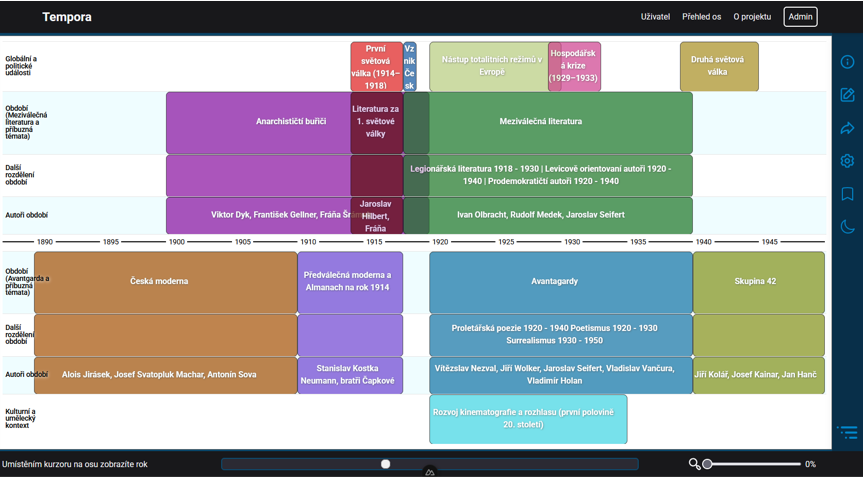
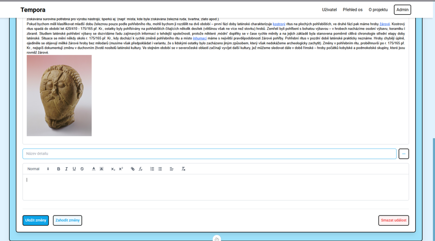
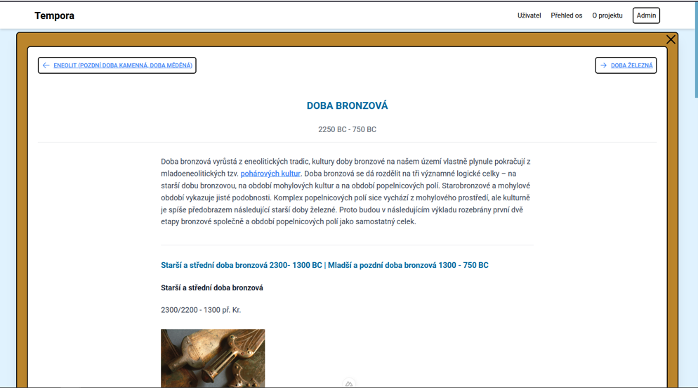

# Tempora - Stránka pro tvorbu interaktivních časových os

Webové stránka sloužící jako nástroj pro tvorbu a vizualizaci interaktivních časových os. Cílem práce bylo umožnit uživatelům tvorbu, procházení a sdílení časových os s možností jejich rozkliknutí pro podrobnější informace o jednotlivých obdobích a autorech. Tyto osy se vyznačují důrazem na zasazení událostí do historického kontextu a umožňují srovnání dvou tématicky odlišných období.

 ➡️  🌐https://tempora-web.vercel.app  ⬅️

 

🥈 Druhé místo [Středoškolské odborné činnosti](https://www.soc.cz/) 2024/25,
 kategorie 12 - Tvorba učebních pomůcek, didaktická technologie

## ✨ Funkce

- 📅 Interaktivní vizualizace časové osy
- 🌍 Kontextové vztahy mezi událostmi
- 🎨 Možnost přizpůsobení vzhledu časové osy
- 🔖 Systém záložek
- 🌓 Podpora světlého/tmavého režimu

## 🚀 Instalace

### Požadavky

- Node.js 18+ 📦
- Supabase účet / SUPABASE_KEY 🗃️
- Git 🔄

### Instalace

1. Naklonujte repozitář:
```bash
git clone https://github.com/your-username/tempora.git
cd tempora
```

2. Nainstalujte závislosti:
```bash
npm install
```

3. Nastavte proměnné prostředí:
```bash
cp .env.example .env
```

Upravte soubor `.env` a doplňte své Supabase přihlašovací údaje:
```env
SUPABASE_URL=your-supabase-url
SUPABASE_KEY=your-supabase-key
```

4. Spusťte vývojový server:
```bash
npm run dev
```

Otevřete  `http://localhost:3000` 🎉

## 🛠️ Technologie

- [Nuxt 3](https://nuxt.com/) - Vue Framework
- [Supabase](https://supabase.com/) - Backend jako služba
- [Vue Timeline Chart](https://github.com/grocky/vue-timeline-chart) - Vizualizace časové osy
- [Nuxt UI](https://ui.nuxt.com/) - UI komponenty
- [TailwindCSS](https://tailwindcss.com/) - Stylování

## 📸 Ukázky

### Časová osa



### Editace události



### Detail události



## 📝 Použití
1. **Vytvoření časové osye**
   - Jděte do záložky „Přehled os“
   - Klikněte na „Nová časová osa“
   - Nastavte parametry časové osy a vytvořte ji

2. **Přidání událostí**
   - Zapněte editační režim a použijte tlačítko „+“ v postranním panelu
   - Nastavte časový rozsah, barvu název
   - Vyplňte podrobnosti o události

3. **Navigace**
   - Posuvníkem měnte zobrazovanou část časové osy
   - Přibližujte pomocí Ctrl + kolečko myši nebo lupou
   - Kliknutím na událost zobrazíte podrobnosti
  
📄 Pro více informací se podívejte do 


---

## 📜 Licence  
Tempora je licencovaná MIT licencí. Více informací v `LICENSE.md`.  


<!---
## 🤝 Contributing

1. Fork the Project
2. Create your Feature Branch (`git checkout -b feature/AmazingFeature`)
3. Commit your Changes (`git commit -m 'Add some AmazingFeature'`)
4. Push to the Branch (`git push origin feature/AmazingFeature`)
5. Open a Pull Request
-->
